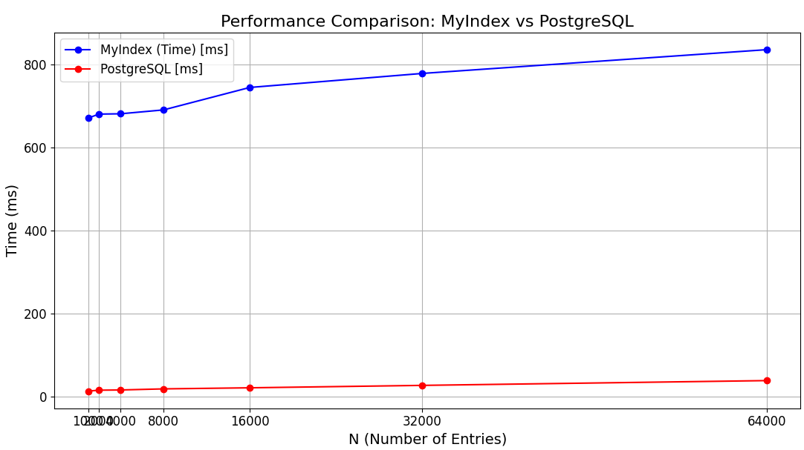

# BUDE Recommendation System

This README provides instructions on how to set up the Django project,
load songs from a CSV file into the database, update the search vectors, 
run the required migrations, and configure the search API.

### Setup

#### Prerequisites

- Python 3.x
- Django
- PostgreSQL
- psycopg2-binary
- djangorestframework

#### 0. Start Docker Compose

1. **Start the docker-compose to run the PostgreSQL database:**

    ```sh
    docker-compose up
    ```

2. Enter the container to run the migrations and load the songs from the CSV file:

    ```sh
    docker exec -it bude_server bash
    ```

#### 1. Run the Migrations

1. **Run the migrations to create the necessary database tables:**

    ```sh
    python manage.py makemigrations
    python manage.py migrate
    ```

#### 2. Load Songs from CSV

1. **Place your CSV file (`spotify_songs.csv`) in the project directory.**

2. **Run the management command to load the songs from the CSV file:**

    ```sh
    python manage.py load_songs
    ```

#### 3. Update Search Vector

1. **Run the management command to update the search vectors for the songs:**

    ```sh
    python manage.py update_search_vector
    ```

#### 4. Create Our Custom Inverted Index

1. **Run the management command to create the inverted index for the songs:**

    ```sh
    python manage.py build_index
    ```

#### 5. Configure Search API

The search API provides two endpoints for searching songs in the database:

1. **Postgres Search API** (`/postgres-search/`): This endpoint uses PostgreSQL full-text search to return ranked search results based on the query. The API accepts two query parameters: `query` for the search term and `k` for the number of results to return.

2. **Custom Search API** (`/custom-search/`): This endpoint uses your custom inverted index to return ranked search results based on the query. It also accepts `query` for the search term and `k` for the number of results to return.

**API Usage Example:**

- **Postgres Search API:**

    ```
    GET /postgres-search/?query=your_search_term&k=10
    ```

- **Custom Search API:**

    ```
    GET /custom-search/?query=your_search_term&k=10
    ```

Both endpoints return a list of songs with the following fields:

- `track_id`: The unique ID of the track.
- `track_name`: The name of the track.
- `track_artist`: The artist of the track.
- `lyrics`: The lyrics of the track.
- `rank`: The relevance rank of the track based on the search query.

With these steps, you can set up your Django project, load song data, update the search vectors, and utilize the search API to perform efficient searches.

### Report

#### Introduction

This project aims to understand and apply search and information retrieval algorithms based on content. 
The project is divided into two parts: 
a) optimal construction of an Inverted Index for text search and retrieval tasks and 
b) construction of a multidimensional structure to support efficient search and
retrieval of images/audio using characteristic vectors. 
Both implementations will be applied to improve search in a recommendation system.

#### Project Structure

- `main.py`: Contains the implementation of the inverted index and the query logic.
- `spotify_songs.csv`: CSV file with Spotify songs.
- `blocks/`: Directory where partial blocks are stored.
- `tf_idf.json`: JSON file with the IDF values for each term.
- `doc_norms.json`: JSON file with the norms of the documents.

#### Process Explanation

#### Part 1: Construction of the Textual Inverted Index (Full-Text Search)

##### Backend

1. **Implementation of the inverted index using the ranking retrieval model for free-text queries.**
    - **Preparation:**
        - A dataset from Kaggle is used.
    - **Preprocessing:**
        - Tokenization
        - Stopwords filtering
        - Stemming
    - **Index Construction:**
        - Block Reading: Read the CSV file in blocks.
        - Preprocessing: Tokenize, remove stopwords, and apply stemming.
        - Partial Index: Create partial indices for each block.
        - Block Writing: Save partial indices in JSON files.
        - Merge Sort: Combine blocks into a single index.
        - Calculate TF-IDF: Calculate and save TD-IDF.

    - **Query:**
        - Query Preprocessing: Tokenize and apply stemming.
        - TF-IDF Calculation: Calculate TF-IDF for query terms.
        - Retrieving Relevant Documents: Search for documents containing the query terms.
        - Cosine Similarity Calculation: Compute cosine similarity between the query and relevant documents.
        - Retrieve Song Lyrics: Retrieve the lyrics of the most relevant songs.
        - The query is a natural language phrase.
        - Scoring is obtained by applying cosine similarity on the inverted index in secondary memory.
        - The retrieval function should return the top-k documents closest to the query.
     
    - **Cosine Similarity**

The `compute_cosine_similarity` function calculates cosine similarities between a query and a set of documents. It first computes the query's norm and returns an empty list if the norm is zero. For each document, it calculates the dot product of term frequencies and the norms of both the query and document vectors. It then computes the cosine similarity by dividing the dot product by the product of the norms and appends the document ID and similarity score to a list. Finally, it returns this list of similarity scores.


### Experiment

1. **Measure the performance of your implementation compared to PostgreSQL.**

| N  | MyIndex (Time) | PostgreSQL |
|----|----------------|-----------------------------|
| 1000  |671.612 ms|    13.524 ms  |
| 2000  |681.134 ms|    15.813 ms  |
| 4000  |681.871 ms|    16.312 ms  |
| 8000  |691.241 ms|    18.954 ms  |
| 16000 |745.314 ms|    21.538 ms  |
| 32000 |779.091 ms|    27.358 ms  |
| 64000 |836.413 ms|    38.912 ms  |



